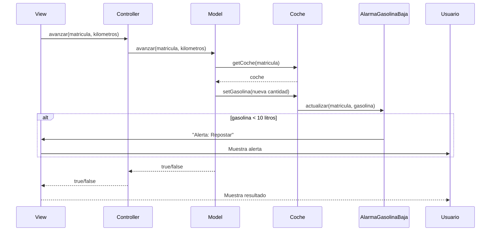
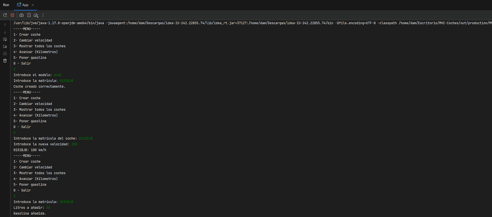
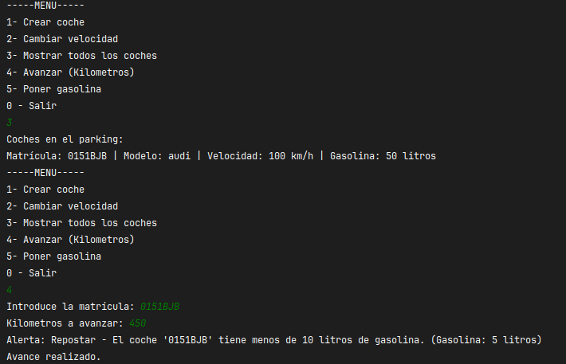

# Exámen 2: Observer

## Funcionalidades
- Sistema de consumo de gasolina al avanzar
- Alerta automática cuando la gasolina baja de 10 litros

### Nuevas Características (Observer Pattern)

### Alarma de Gasolina Baja
Se ha implementado un sistema de notificaciones que:
1. Monitoriza el nivel de gasolina de todos los coches
2. Muestra una alerta automática cuando la gasolina baja de 10 litros
3. Identifica el coche afectado por su matrícula

### Estructura del Observer
1. **GasolinaObserver**: Interfaz para los observadores
2. **AlarmaGasolinaBaja**: Implementación concreta que muestra las alertas
3. **Coche**: Clase observable que notifica cambios en la gasolina

## Diagrama de Secuencia

## Comprobación:
### Primero creamos un nuevo coche como ejemplo y le añadimos 50L de gasolina

### Le Pedimos que avance 450km, y teniendo en cuenta que va a 100km/h y tiene un consumo de 10L cada 100km salta la alarma

---
---
# Examen 1: MVC
### 1. Nuevo Atributo: Gasolina
Añadido gasolina a la clase Coche para controlar el combustible.

Todos los coches nuevos empiezan con 0 litros.

### 2. Funcionalidades Nuevas
Opción 4: Avanzar
Qué hace: Mueve el coche una distancia en metros.

Consumo: Gasta gasolina según la fórmula:

consumo = (metros * velocidad) / 1000  
Ejemplo:

Si avanzas 5000m a 60km/h → gasta 3 litros.

Opción 5: Poner Gasolina
Qué hace: Añade combustible al depósito.

Importante: Solo acepta números positivos.

3. Menú Actualizado
1. Crear coche
2. Cambiar velocidad
3. Mostrar coches
4. Avanzar
5. Poner gasolina
0. Salir

# Arquitectura MVC

Aplicación que trabaja con objetos coches, modifica la velocidad y la muestra

---
## Diagrama de clases:

---

## Diagrama de Secuencia

Ejemplo básico del procedimiento, sin utilizar los nombres de los métodos

El mismo diagrama con los nombres de los métodos

Diagrama con los metodos y funciones de mi programa

